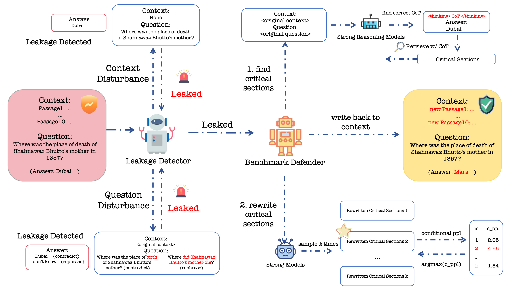

# LastingBench: Defend Benchmarks Against Knowledge Leakage.

Welcome to the repository for the research paper: "LastingBench: Defend Benchmarks Against Knowledge Leakage." This project addresses the growing concern about large language models (LLMs) "cheating" on standard Question Answering (QA) benchmarks by memorizing task-specific data, which undermines the validity of benchmark evaluations as they no longer reflect genuine model capabilities but instead the effects of data leakage.

## Project Overview



LastingBench introduces a novel framework designed to continuously reinforce and safeguard existing benchmarks against knowledge leakage. The project aims to:
- **Detect knowledge leakage** through context and question perturbation techniques
- **Rewrite leaked content** to counterfactual alternatives that disrupt memorization while preserving the benchmark's original evaluative intent  
- **Evaluate model responses** to contextual evidence and reasoning patterns
- **Provide practical solutions** to ensure benchmark robustness over time, promoting fairer and more interpretable evaluations of LLMs


## Installation

1. Clone the repository:
```bash
git clone https://github.com/Seriousss/lastingbench
```

2. Create and activate conda environment:
```bash
conda create -n lastingbench python=3.12
conda activate lastingbench
```

3. Install dependencies:
```bash
pip install -r requirements.txt
```

4. Set up environment variables:
```bash
export OPENAI_BASE_URL="your-api-base-url"
export OPENAI_API_KEY="your-api-key"
export CUDA_VISIBLE_DEVICES="0,1,2,3"  # Adjust based on your GPU setup
```

## Usage

LastingBench provides three main functionalities: **Detection**, **Rewrite**, and **Training Comparision**. 

### 🔍 Detection

Detect knowledge leakage through various perturbation techniques.

#### 1. Context Leakage Detection
Evaluate models using exact-match scoring on benchmark datasets:
```bash
# Using vLLM for most models
python -m detect.contextleakage --hf_model "Qwen/Qwen2.5-7B-Instruct" \
    --dataset_subset "hotpotqa" --cuda_devices "0,1"

# Using Transformers for Qwen3 models  
python -m detect.contextleakage --hf_model "Qwen/Qwen3-8B" \
    --is_qwen3 --max_new_tokens 30

python -m detect.contextleakage_api --model "deepseek-r1" --dataset_subset "hotpotqa"
```


#### 2. Question Perturbation Detection
Rephrase questions to opposite meanings and test model consistency:
```bash
# Using OpenAI API
python -m detect.question_rephrase_answer_api \
    --model_name "gpt-4o" --dataset_subset "2wikimqa" \
    --rephrase_type "opposite" --sample_count 100

# Using local vLLM models
python -m detect.question_rephrase_answer_vllm \
    --model_name "Qwen/Qwen2.5-7B-Instruct" --dataset_subset "hotpotqa" --rephrase_type "similar"

# Using Qwen3 with Transformers
python -m detect.question_rephrase_answer_qwen3 \
    --model_name "Qwen/Qwen3-8B" --dataset_subset "2wikimqa"
```


### ✏️ Rewrite

Generate counterfactual answers and rewrite leaked evidence to create robust benchmarks.
`

#### 1. Evidence Finding and Counterfactual Rewriting Pipeline
Run the complete finding and rewriting pipeline:
```bash

# Specify custom output file and dataset
python main_gpu.py --output custom_output.jsonl \
    --dataset_subset "hotpotqa" --start_idx 0 --max_samples 100

```

Convert and merge JSONL files with question-answer mappings:
```bash
# Merge single mapping file with original dataset
python utils/convert.py original.jsonl revised.jsonl custom_output.jsonl

```
The original and revised dataset can be found under the **data** folder.

#### 2. Random Answer Rewriting
Create random alternatives to disrupt memorization:
```bash
# Specify custom output file and dataset
python random_alternative_answer.py --output random_hotpot.jsonl \
    --dataset_subset "hotpotqa" --start_idx 0 --max_samples 50

```


### 🚀Dataset evaluations on model inference and training


#### 1. Model Inference Evaluation
Comprehensive evaluation on original and revised benchmarks:
```bash
# Transformers-based evaluation
python -m eval.evaluation -i data/hotpotqa.jsonl -model "Qwen/Qwen3-8B" -k 40 -t 0.5

# API-based evaluation  
python -m eval.eval_with_api.py --input data/hotpotqa_antifact.jsonl \
    --model "deepseek-r1" --max_tokens 30 --temperature 0.5
```

#### 2. Model training Evaluation
Compare training dynamics between original and rewritten datasets:

The training loss data can be found under **training_result**. 

To repoduce the picture in our paper:
```bash
python utils/draw.py training_result/training_loss_qwen38.csv training_result/training_loss_antifact_qwen38.csv \
    --title "Original vs Rewritten Training Loss"
```


### 📊 Utility Functions

Additional tools for analysis and metrics:

- **Metrics Calculation**: F1 scores, EM scores, and custom evaluation metrics
- **Document Retrieval**: BM25-based retrieval for evidence analysis

All scripts support various parameters for customization. Use `--help` with any script to see available options.

